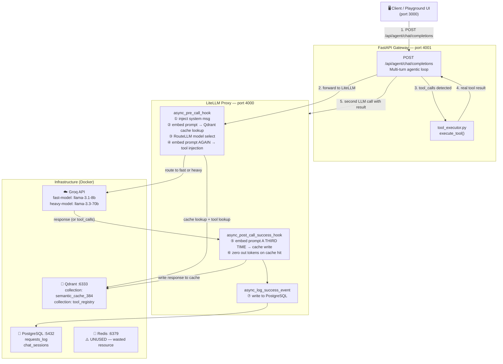
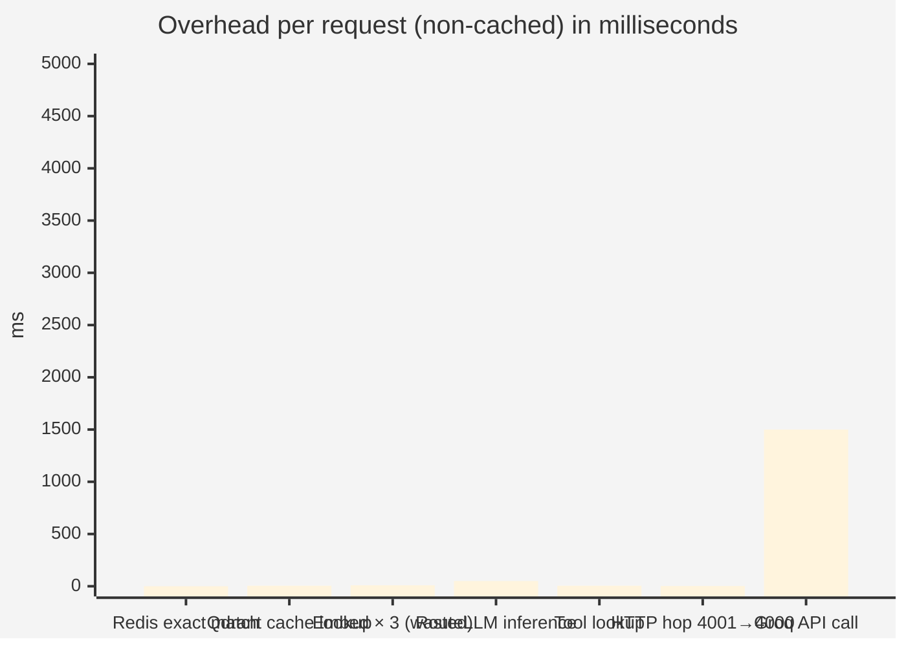
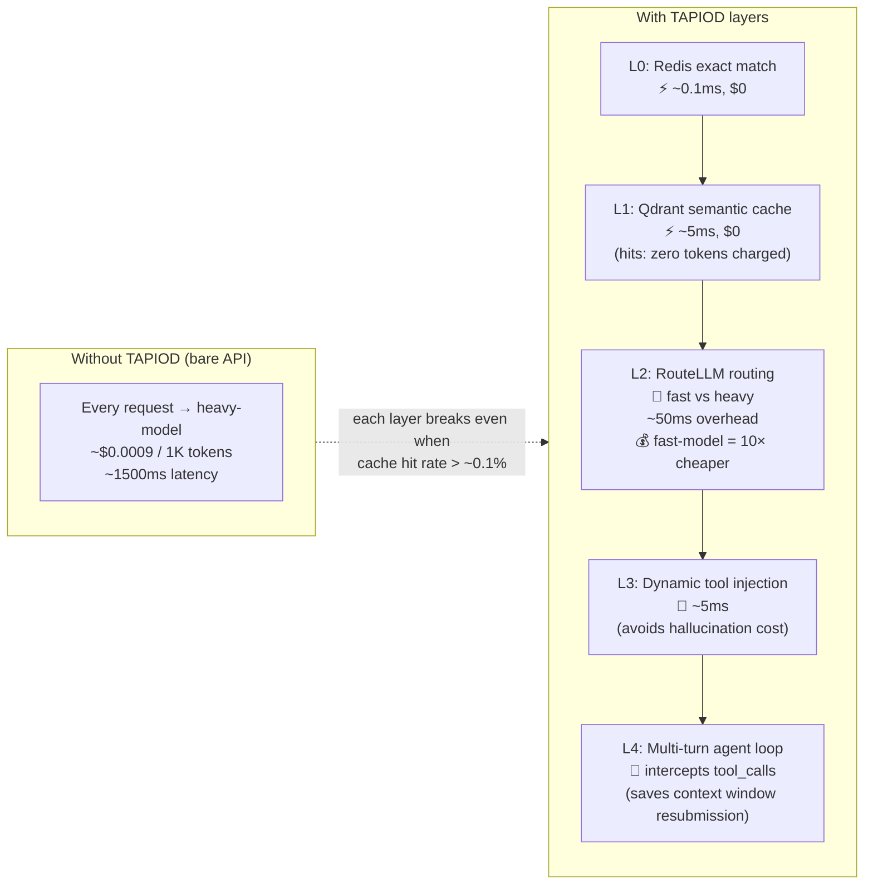
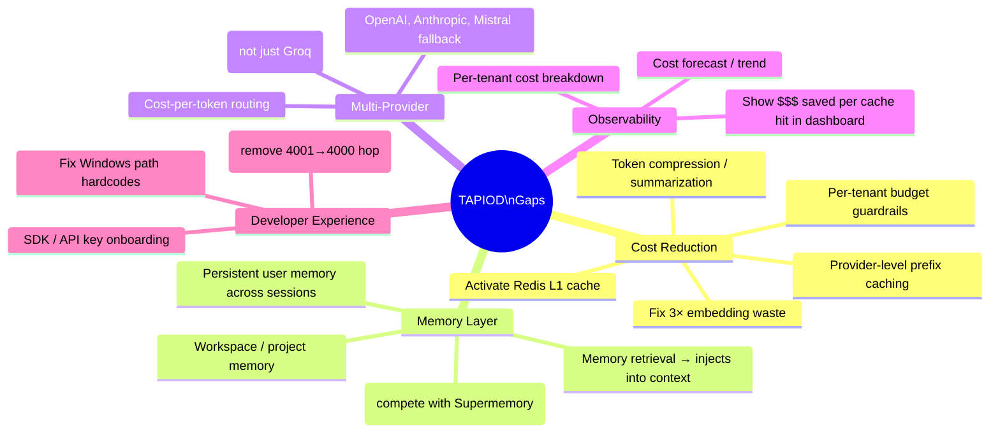
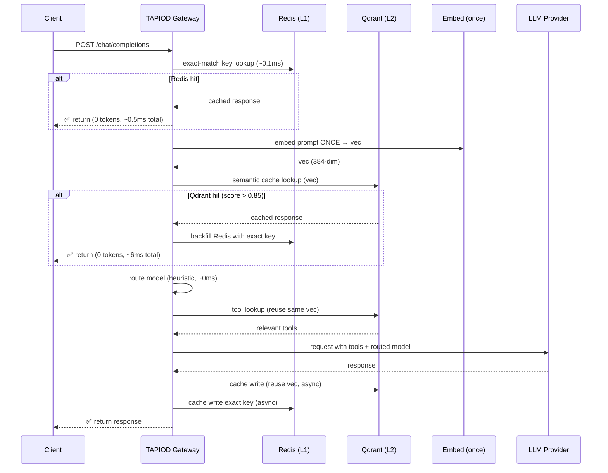

# TAPIOD Architecture & Cost Layer Analysis

## Current Request Flow

---

## Cost Per Layer (Current State)

> **Key waste:** The prompt is embedded **3 separate times** per request — once for cache lookup, once for tool injection, and once again in the post-call hook for cache write.  
> **Redis is running but receives zero traffic.**

---

## Where the Layers Actually Save Cost

---

## What's Missing to Compete

---

## Proposed: Zero-Cost Overhead Architecture

> **Single embedding per request.** Redis handles repeated identical prompts. Qdrant handles semantically similar ones. Cache writes are async and don't block the response.
