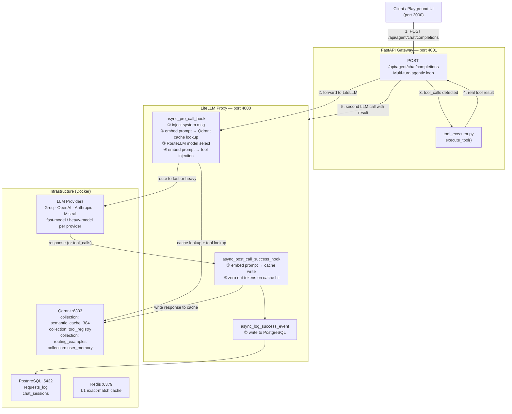
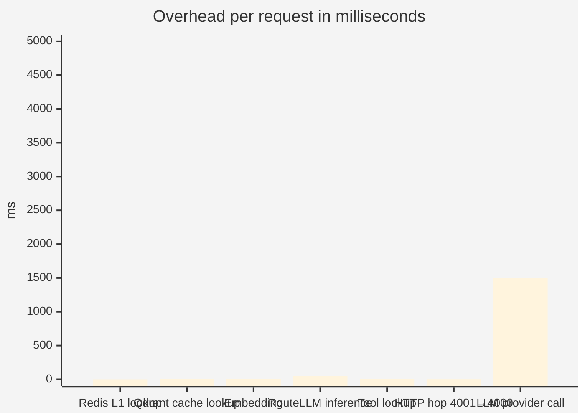
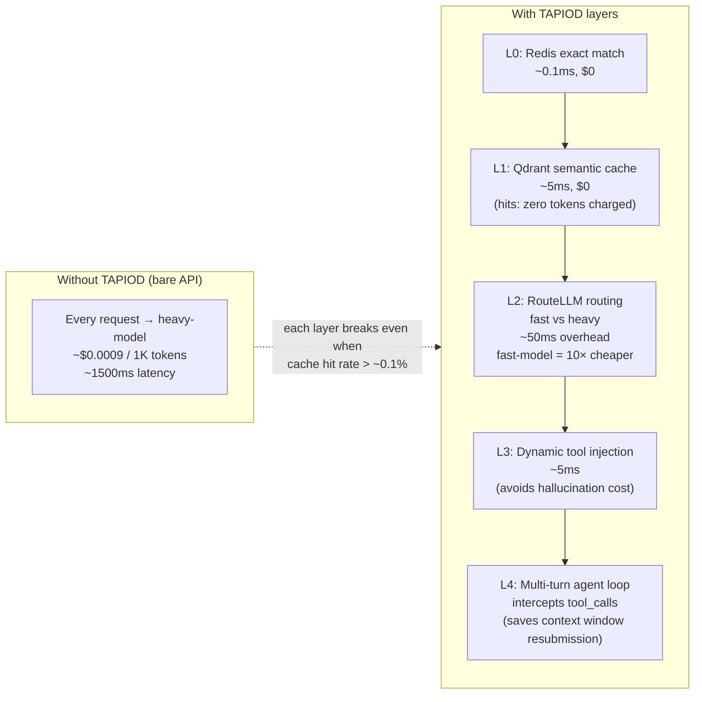
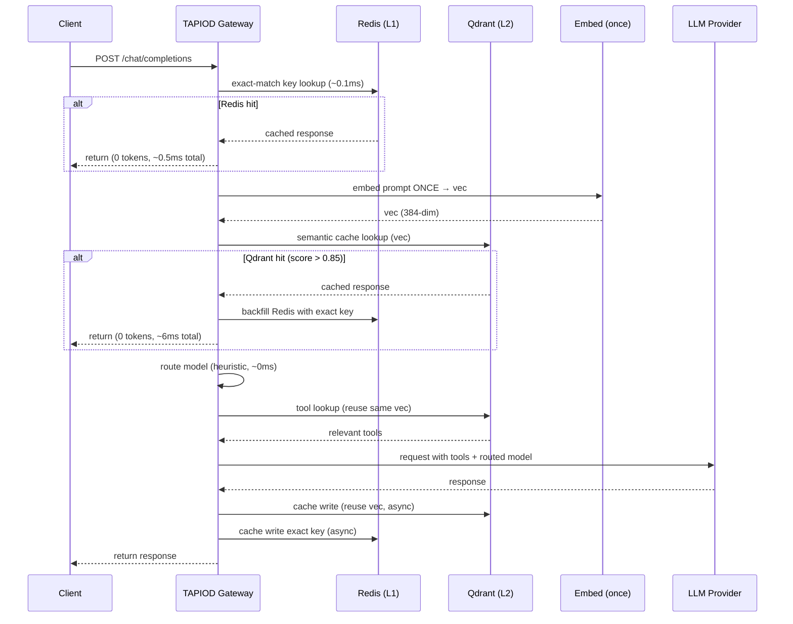

# TAPIOD Architecture

## Request Flow

---

## Latency Breakdown (per request, non-cached)

> The semantic cache and smart routing are the primary cost-savers: a cache hit costs zero tokens and returns in ~5 ms; routing simple prompts to the fast model typically reduces token cost by 10×.

---

## Where the Layers Save Cost

---

## Optimized Single-Embedding Architecture

The current implementation embeds the prompt once per hook invocation; the architecture below shows the target design where a single embedding vector is computed once and reused across all lookups in the same request.

> **Single embedding per request.** Redis handles repeated identical prompts. Qdrant handles semantically similar ones. Cache writes are async and do not block the response.

---

## Qdrant Collections

| Collection | Dimensions | Purpose |
|---|---|---|
| `semantic_cache_384` | 384 | Cached LLM responses, keyed by prompt embedding |
| `tool_registry` | 384 | Tool definitions; top-3 injected per request by cosine similarity |
| `routing_examples` | 384 | 5,000 labelled prompts used for KNN-based fast/heavy routing |
| `user_memory` | 384 | Per-tenant persistent memory, injected into context |

---

## Infrastructure

| Service | Port | Role |
|---|---|---|
| Qdrant | 6333 / 6334 | Vector store — cache, tools, routing, memory |
| PostgreSQL | 5432 | Request logs and chat session storage |
| Redis | 6379 | L1 exact-match cache layer |
| LiteLLM Proxy | 4000 | Model routing, hooks, provider abstraction |
| FastAPI Gateway | 4001 | Agentic loop, tool execution, metrics API |
| Next.js Dashboard | 3000 | Live traces, observability, config UI |

**Supported LLM providers** (configured via the Config page or `routing_config.json`): Groq, OpenAI, Anthropic, Mistral. Provider priority and model-tier mapping are set at runtime — no code changes required to switch providers.
